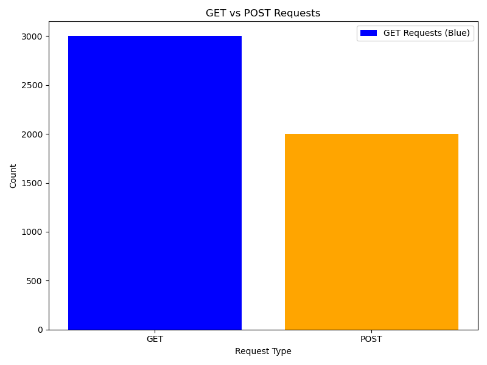
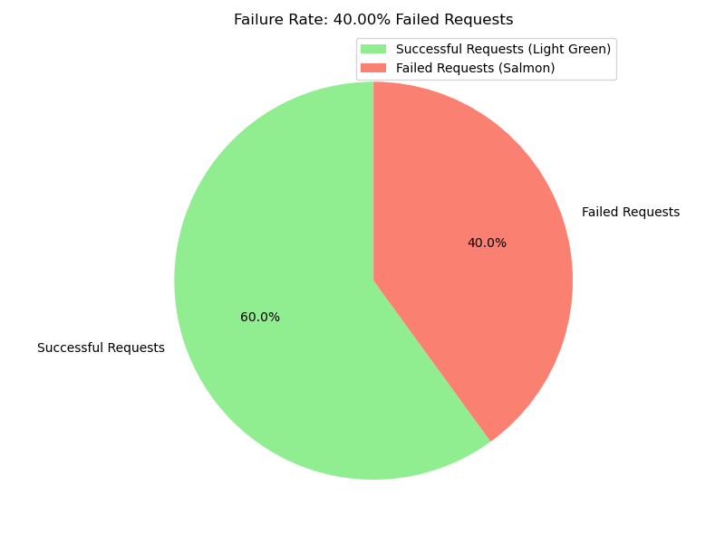
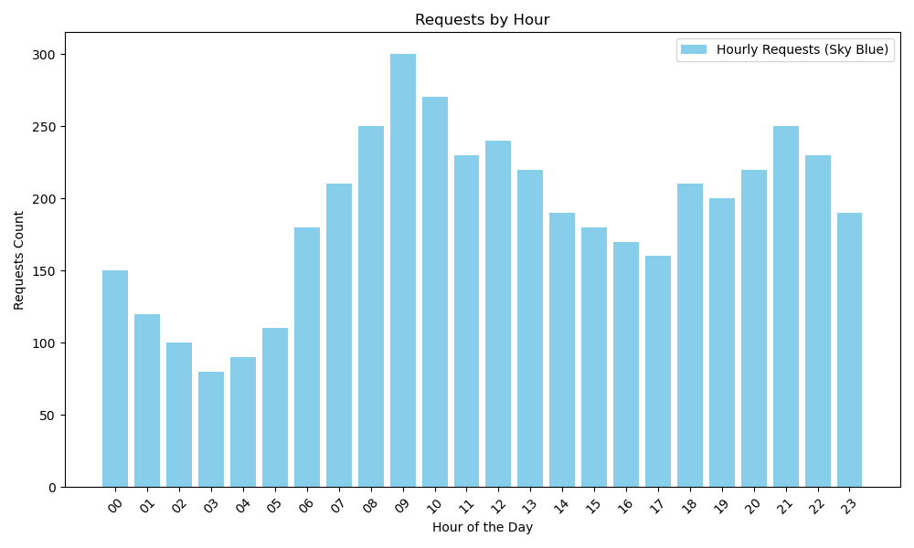
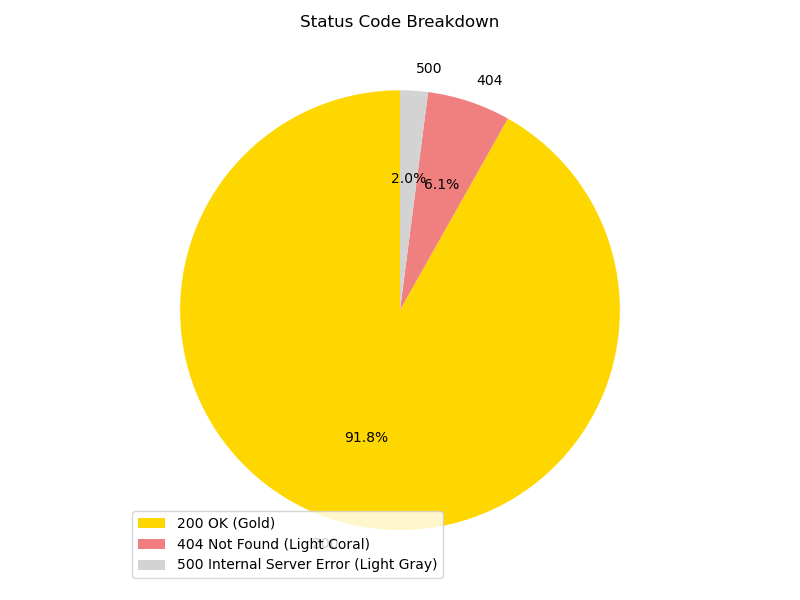

# Log_Analysis
This is a log analysis with graphs

# Log File Analysis Graphs

### 1. **GET vs POST Requests**

### 2. **Failure Rate**

### 3. **Requests by Hour**

### 4. **Status Code Breakdown**

